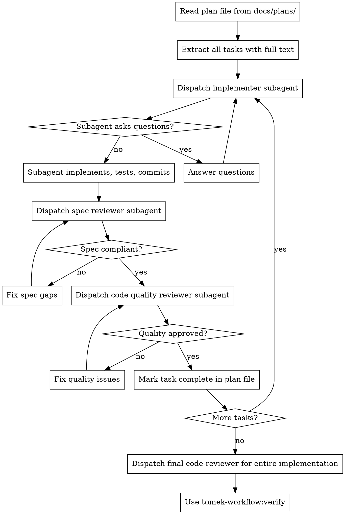

# Build

## Overview

Execute a plan by dispatching a fresh subagent per task. Independent tasks (no dependency annotations) run in parallel. Two-stage review after each task: spec compliance first, then code quality.

**Always dispatches to subagents** — fresh subagent per task to prevent context bloat in the main session. The only exception: trivial tasks (< 5 min, single file) from the "just do it" routing path are done inline without a plan file.

**Announce at start:** "I'm using the build skill to execute this plan."

## Process

### Step 1: Load Plan

Read the plan file from `docs/plans/`. Extract all tasks with their full text and context. Note dependency annotations.

### Step 2: Execute Tasks

For each task (respecting dependency order, parallel dispatch for independent tasks):

1. **Dispatch implementer subagent** using `./implementer-prompt.md` template — provide the full task text (don't make the subagent read the plan file)
2. If subagent has questions, answer them before letting it proceed
3. After implementation: **dispatch spec reviewer** using `./spec-reviewer-prompt.md`
4. If spec issues found: implementer fixes, spec reviewer re-reviews
5. After spec approval: **dispatch code quality reviewer** using `./code-quality-reviewer-prompt.md`
6. If quality issues found: implementer fixes, quality reviewer re-reviews
7. Mark task complete in the plan file

### Step 3: Final Review

After all tasks complete, dispatch the `code-reviewer` agent for the entire implementation.

### Step 4: Verify

Invoke the `verify` skill.

## Hard Gates

- Plan file must exist before building
- Spec compliance review must pass BEFORE code quality review (correct order)
- Both reviews must pass before marking a task complete
- Never dispatch multiple implementation subagents in parallel (conflicts)
- Never skip reviews — not for spec compliance, not for code quality

## Anti-Patterns

- Making subagent read the plan file — provide full text instead
- Skipping spec review because "it's obviously correct" — spec reviewer exists to catch what you missed
- Starting code quality review before spec compliance passes — wrong order
- Doing implementation inline instead of via subagent — pollutes main context
- Accepting "close enough" on spec compliance — spec reviewer found issues = not done
- Proceeding with unfixed review issues — fix, re-review, repeat

## Output

- Implementation code committed per task
- Plan file updated with completion markers
- All tasks verified through two-stage review

## Next Step

Invoke the `verify` skill, then `finish-branch`.
